## Consultas MySQL 

### 1. Cantidad de usuarios por género y localidad.

**Álgebra Relacional:** 

$$πGenero,Localidad,COUNT(∗)→Cantidad_Usuarios(σu.id_genero=g.id_genero∧u.id_residencia=r.id_residencia∧r.id_localidad=l.id_localidad(Usuarios×Genero×Residencia×Localidad))$$

**SQL equivalente:**
```sql
SELECT g.Genero, l.Localidad, COUNT(*) AS Cantidad_Usuarios
FROM usuarios u
JOIN genero g ON u.id_genero = g.id_genero
JOIN residencia r ON u.id_residencia = r.id_residencia
JOIN localidad l ON r.id_localidad = l.id_localidad
GROUP BY g.Genero, l.Localidad;

```

<div align="center">
  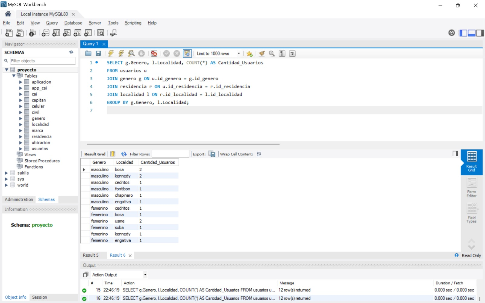
</div>

### 2. Usuarios con dispositivos de una marca específica.

**Álgebra Relacional:** 

$$πu.Nombre,u.Apellido,m.Marca,c.Referencia(σ .Marca="Samsung(Usuarios⋈Celular⋈Marca))$$

**SQL equivalente:**
```sql
SELECT u.Nombre, u.Apellido, m.Marca, c.Referencia
FROM usuarios u
LEFT JOIN celular c ON u.Imei = c.Imei
LEFT JOIN marca m ON c.Id_marca = m.Id_marca
WHERE m.Marca = "Samsung";

```
<div align="center">
  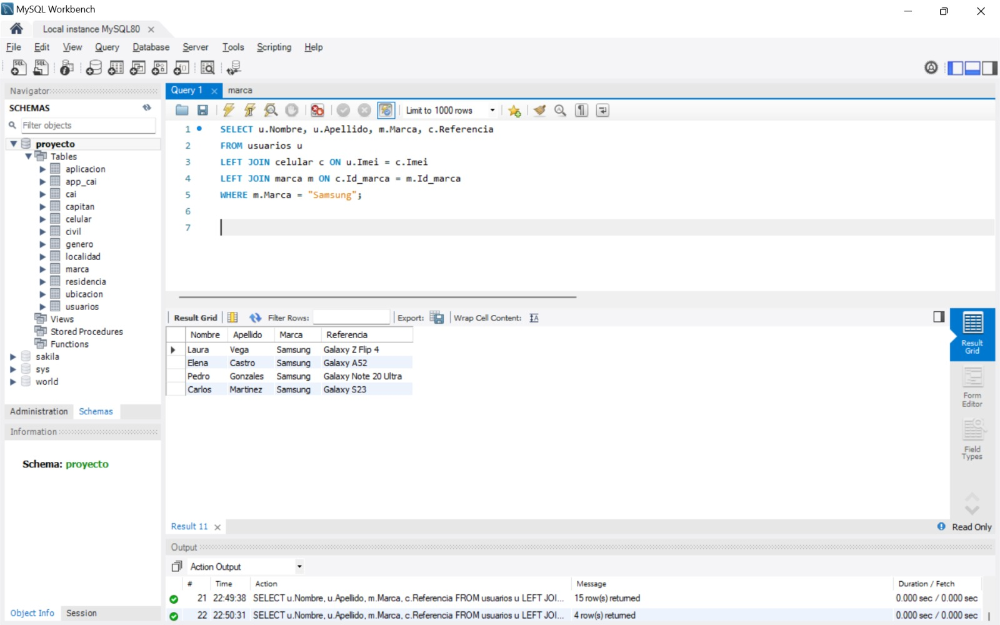
</div>

### 3. Cantidad de usuarios registrados en cada CAI.

**Álgebra Relacional:** 

$$π CAI,COUNT(∗)→Cantidad_Usuarios(σu.id_residencia=r.id_residencia∧r.id_localidad=cai.id_localidad(Usuarios×Residencia×CAI))$$

**SQL equivalente:**
```sql
SELECT cai.Nombre AS CAI, COUNT(*) AS Cantidad_Usuarios
FROM usuarios u
JOIN residencia r ON u.id_residencia = r.id_residencia
JOIN cai ON r.id_localidad = cai.id_localidad
GROUP BY cai.Nombre;

```
<div align="center">
  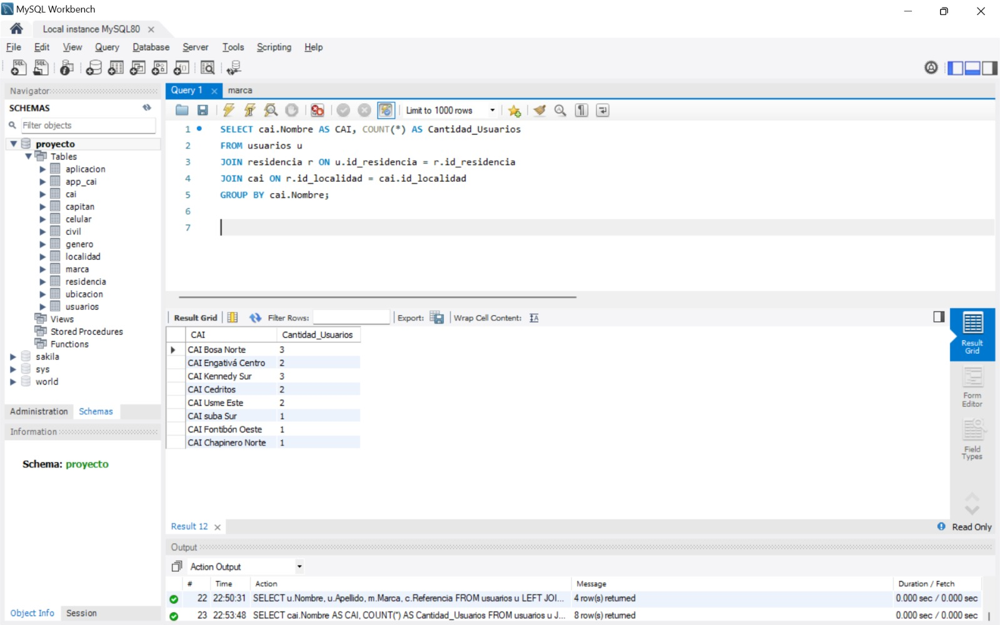
</div>

### 4. Usuarios registrados en un rango de edades específico.

**Álgebra Relacional:** 

$$π u.Nombre,u.Apellido,u.Fecha_de_nacimiento(σEdadEntre(18,30(Usuarios)$$

**SQL equivalente:**
```sql
SELECT u.Nombre, u.Apellido, u.Fecha_de_nacimiento
FROM usuarios u
WHERE YEAR(CURDATE()) - YEAR(STR_TO_DATE(u.Fecha_de_nacimiento, '%d-%m-%Y')) BETWEEN 18 AND 30;
SELECT u.Nombre, u.Apellido, u.nacimiento
FROM usuarios u
WHERE YEAR(CURDATE()) - YEAR(STR_TO_DATE(u.nacimiento, '%d/%m/%Y')) BETWEEN 18 AND 30;

```
<div align="center">
  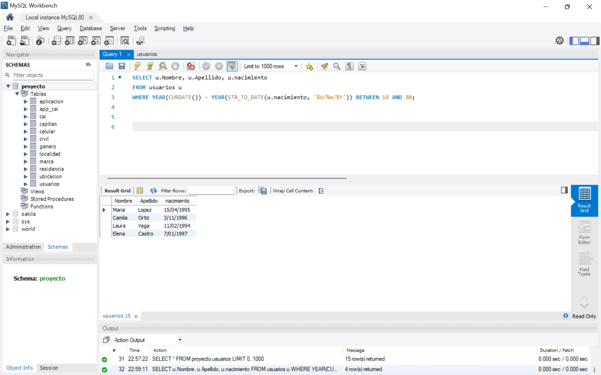
</div>

### 5. Total de Usuarios por Estado Civil y Género.

**Álgebra Relacional:** 

$$O=τ Total_UsuariosDESC(γ Estado_civil,Genero;COUNT(∗)((usuarios⋈u.id_civil=c.id_civilcivil)⋈ u.id_genero=g.id_genero genero))$$

**SQL equivalente:**
```sql
SELECT 
    c.Estado_civil, 
    g.Genero, 
    COUNT(*) AS Total_Usuarios
FROM usuarios u
JOIN civil c ON u.id_civil = c.id_civil
JOIN genero g ON u.id_genero = g.id_genero
GROUP BY c.Estado_civil, g.Genero
ORDER BY Total_Usuarios DESC;

```
<div align="center">
  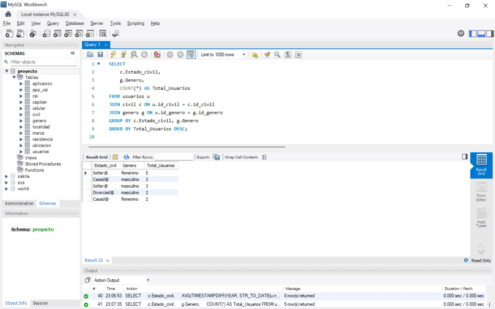
</div>

### 6. Usuarios con más de un registro en la tabla aplicaciones

**Álgebra Relacional:** 
π u.Nombre,u.Apellido,COUNT(a.id_app)→Total_Apps(σ u.Identificacion=a.Identificacion(Usuarios×Aplicaciones))

**SQL equivalente:**
```sql
SELECT u.Nombre, u.Apellido, COUNT(a.id_app) AS Total_Apps
FROM usuarios u
JOIN aplicacion a ON u.Identificacion = a.Identificacion
GROUP BY u.Identificacion
HAVING Total_Apps > 1;

```
<div align="center">
  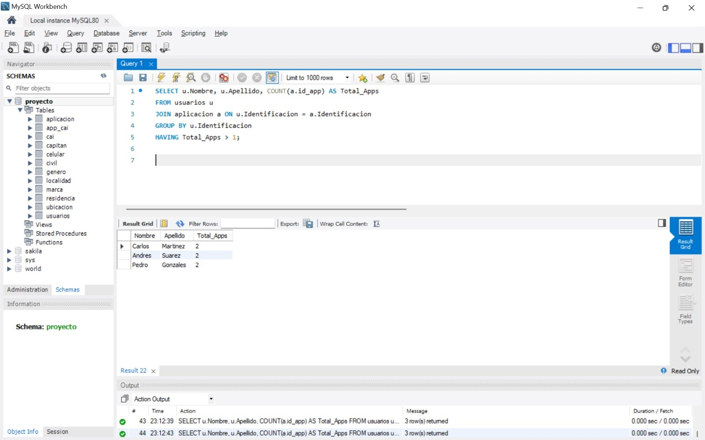
</div>

### 7. Top 5 de localidades con mayor cantidad de usuarios

**Álgebra Relacional:** 

π Localidad,COUNT(∗)→Cantidad_Usuarios(σ u.id_residencia=r.id_residencia&r.id_localidad=l.id_localidad(Usuarios×Residencia×Localidad))

**SQL equivalente:**
```sql
SELECT l.Localidad, COUNT(*) AS Cantidad_Usuarios
FROM usuarios u
JOIN residencia r ON u.id_residencia = r.id_residencia
JOIN localidad l ON r.id_localidad = l.id_localidad
GROUP BY l.Localidad
ORDER BY Cantidad_Usuarios DESC
LIMIT 5;

```
<div align="center">
  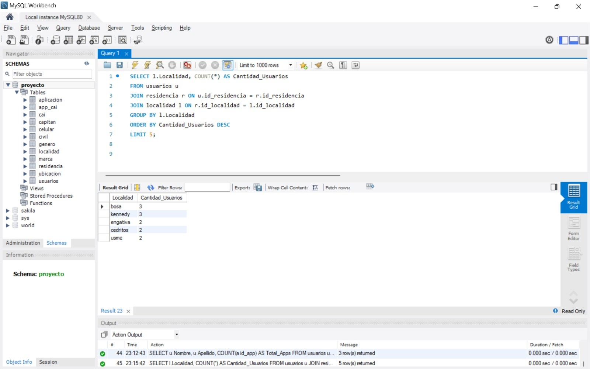
</div>

### 8. CAIs con el mayor número de aplicaciones asociadas

**Álgebra Relacional:** 

π CAI,COUNT(app_cai.id_app)→Total_Apps(σ cai.id_CAI=app_cai.id_CAI(CAI×App_CAI))

**SQL equivalente:**
```sql
SELECT cai.Nombre AS CAI, COUNT(app_cai.id_app) AS Total_Apps
FROM cai
JOIN app_cai ON cai.id_CAI = app_cai.id_CAI
GROUP BY cai.Nombre
ORDER BY Total_Apps DESC;

```
<div align="center">
  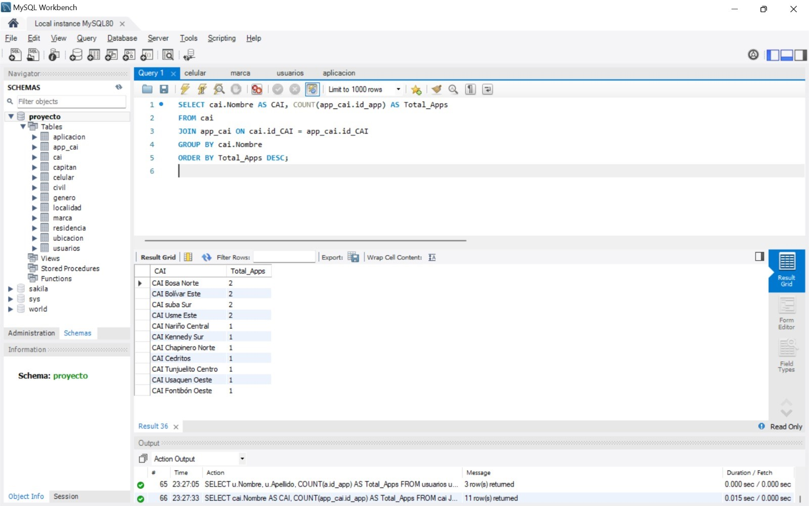
</div>

### 9. Usuarios que residen en una localidad específica con sus CAIs asignados

**Álgebra Relacional:** 

π u.Nombre,u.Apellido,l.Localidad,cai.Nombre(σ l.Localidad=′Usaqueˊn′(Usuarios×Residencia×Localidad×CAI))

**SQL equivalente:**
```sql
SELECT u.Nombre, u.Apellido, l.Localidad, cai.Nombre AS CAI
FROM usuarios u
JOIN residencia r ON u.id_residencia = r.id_residencia
JOIN localidad l ON r.id_localidad = l.id_localidad
JOIN cai ON l.id_localidad = cai.id_localidad
WHERE l.Localidad = 'Bosa';

```
<div align="center">
  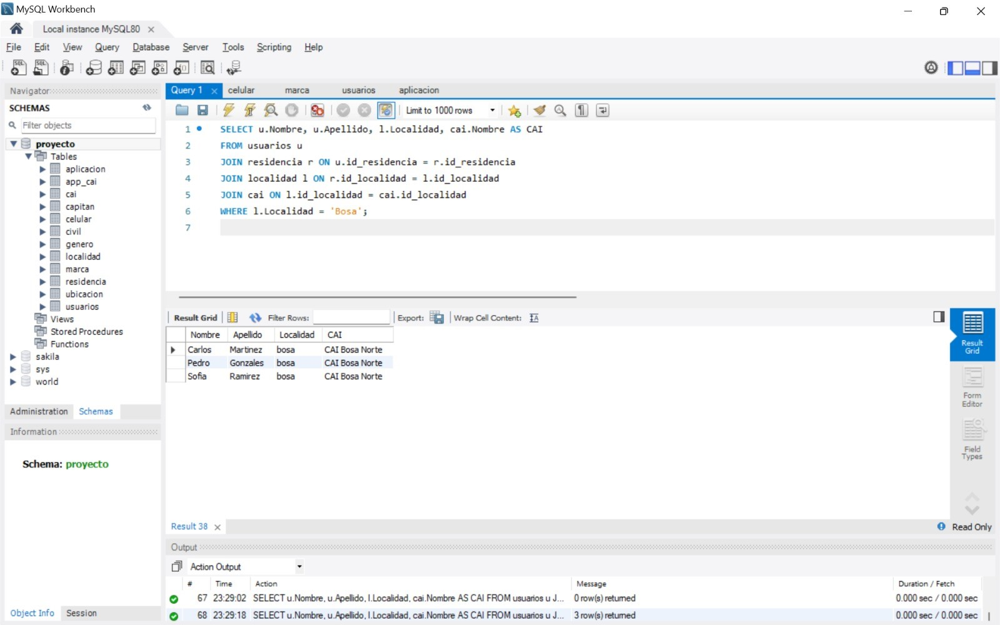
</div>

### 10. Usuarios asignados a un capitán específico

**Álgebra Relacional:** 

π u.Nombre,u.Apellido,cap.Nombre(σ cap.Nombre= ′JuanPerez ′(Usuarios×Residencia×CAI×Capitaˊn))

**SQL equivalente:**
```sql
SELECT u.Nombre, u.Apellido, cap.Nombre AS Capitan
FROM usuarios u
JOIN residencia r ON u.id_residencia = r.id_residencia
JOIN cai ON r.id_localidad = cai.id_localidad
JOIN capitan cap ON cai.id_capitan = cap.id_capitan
WHERE cap.Nombre LIKE '%Maria%';

```
<div align="center">
  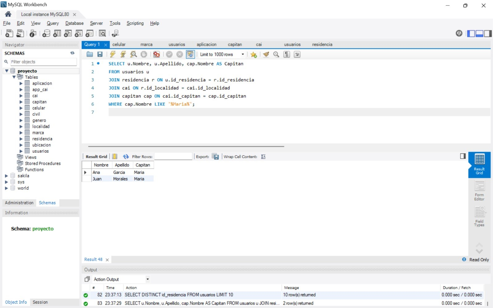
</div>

### 11. Listar los nombres y correos electrónicos de todos los usuarios junto con la marca de su celular.

**Álgebra Relacional:** 

π Nombre,Email,Marca(σ usuarios.Imei=celular.Imei(usuarios⋈celular⋈marca))

```sql
SELECT usuarios.Nombre, usuarios.Email, marca.Marca
FROM usuarios
JOIN celular ON usuarios.Imei = celular.Imei

JOIN marca ON celular.Id_marca = marca.Id_marca;
```

 

### 12. Obtener la dirección de residencia de los usuarios cuyo género sea "Femenino".

**Álgebra Relacional:** 

π Nombre,Direccion_Residencia(σGenero=′Femenino′(usuarios⋈genero⋈residencia))

```sql
SELECT usuarios.Nombre, residencia.Direccion_Residencia
FROM usuarios
JOIN genero ON usuarios.Id_genero = genero.Id_genero
JOIN residencia ON usuarios.Id_residencia = residencia.Id_residencia
WHERE genero.Genero = 'Femenino';
```


### 13. Determinar las marcas de celulares más comunes entre los usuarios.

**Álgebra Relacional:** 

π DESC (LIMIT 1)(γMarca,COUNT(Imei)(marca⋈celular))

```sql
SELECT marca.Marca, COUNT(celular.Imei) AS Total_Usuarios
FROM marca
JOIN celular ON marca.Id_marca = celular.Id_marca
GROUP BY marca.Marca
ORDER BY Total_Usuarios DESC
LIMIT 1;
SELECT marca.Marca, COUNT(celular.Imei) AS Total_Usuarios
FROM marca
JOIN celular ON marca.Id_marca = celular.Id_marca
GROUP BY marca.Marca
ORDER BY Total_Usuarios DESC
LIMIT 1;
```


### 14. Promedio de robos por localidad

**Álgebra Relacional:** 

π Localidad,AVG(Total_Aplicaciones)(subquery⋈localidad)

```sql
SELECT localidad.Localidad, AVG(Total_Aplicacion) AS Promedio_Aplicacion
FROM (
  SELECT aplicacion.Id_ubicacion, COUNT(aplicacion.Id_app) AS Total_Aplicacion
  FROM aplicacion
  GROUP BY aplicacion.Id_ubicacion
) AS subquery
JOIN localidad ON subquery.Id_ubicacion = localidad.Id_localidad
GROUP BY localidad.Localidad;
```


### 15. Obtener los IMEI de los celulares de usuarios que viven en una localidad específica.

**Álgebra Relacional:** 

π Nombre,Imei,Localidad(σLocalidad=′ˊn′(usuarios⋈celulabosar⋈residencia⋈localidad))

```sql
SELECT usuarios.Nombre, celular.Imei, localidad.Localidad
FROM usuarios
JOIN celular ON usuarios.Imei = celular.Imei
JOIN residencia ON usuarios.Id_residencia = residencia.Id_residencia
JOIN localidad ON residencia.Id_localidad = localidad.Id_localidad
WHERE localidad.Localidad = 'bosa';
```


### 16. listar los robos ocurridos en un rango de fechas

**Álgebra Relacional:**

π Id_app,Fecha,Nombre(σ Fecha∈[01-01-2024,30-04-2024](aplicaciones⋈usuarios))

```sql
SELECT aplicacion.Id_app, aplicacion.Fecha, usuarios.Nombre
FROM aplicacion
JOIN usuarios ON aplicacion.Identificacion = usuarios.Identificacion
WHERE aplicacion.Fecha BETWEEN '01-01-2024' AND '30-04-2024';
```

<div align="center">
  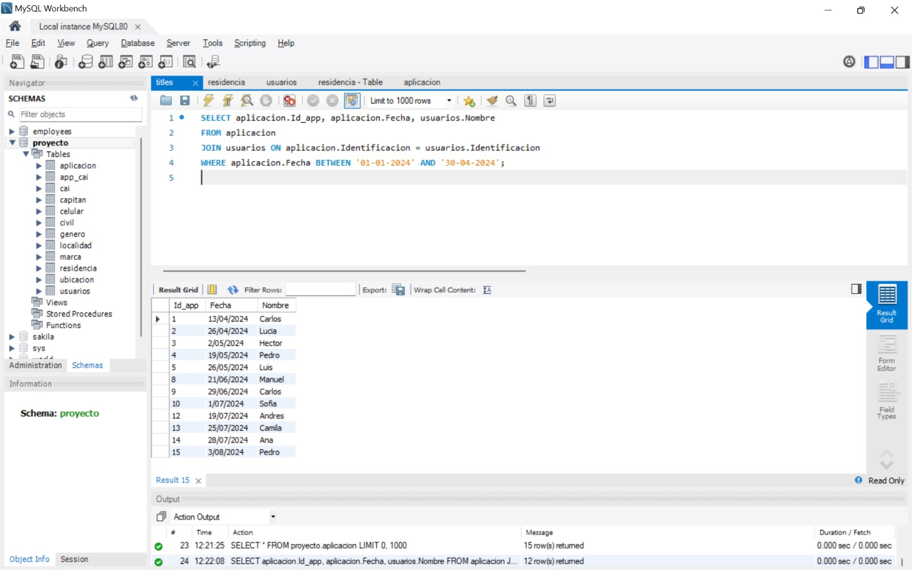
</div>
