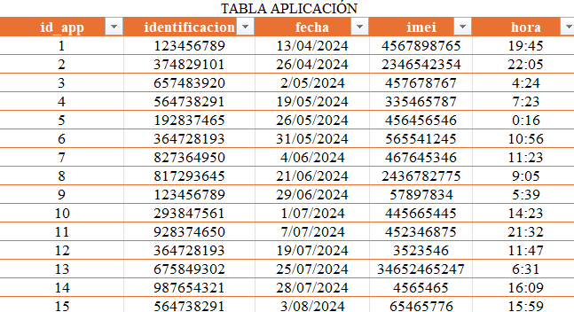

# Normalizacion

Es un proceso sistemático utilizado en base de datos relacionales para organizar los datos en tablas para eliminar redundancias y garantizar la integridad. Esta implica en 
dividir una tabla cruda en varias tablas relacionadas ,más pequeñas, con datos independientes y que muestren un propósito claro. El proceso consiste en aplicar 
reglas conocidas como formas normales (1FN, 2FN, 3F). Esto mejora la eficiencia, reduce errores y facilita el mantenimiento de la base de datos.

## las tablas iniciales (CRUDAS) son las siguientes:

## 1.
### Tabla de Usuarios

  

## 2.
### Tabla de la Aplicacion

  

## 3.
### Tabla de los CAIS

  

## La Primera Forma Normal (1FN):

Es una regla fundamental en el diseño de bases de datos relacionales que establece los siguientes requisitos:

1. Eliminar grupos repetitivos o columnas duplicadas.
2. Crear una tabla separada para cada grupo de datos relacionados.
3. Identificar cada registro con una clave primaria única.
4. Los valores en las columnas deben ser atómicos (indivisibles).

## Tabla Usuario
Se mantuvieron los datos básicos del usuario
Se conservó la identificación como clave primaria
Se removieron los datos de ubicación y dispositivo

  

## Tabla Aplicacion
Se creó para registrar el uso de la aplicación
Se generó un id_app como clave primaria
Se relaciona con usuarios mediante la identificación
Se separó la fecha y hora en columnas distintas

  

## Tabla Direccion
Se creó una tabla específica para las direcciones
Se generó un id_residencia como clave primaria
Se separó la localidad_residencia de la dirección completa

  

## Tabla Ubicaciones APP
Se separaron las ubicaciones reportadas en la aplicación
Se creó un id_ubicacion como clave primaria
Se separó la localidad de la ubicación específica

  

## Tabla Celulares
Se separó la información de los dispositivos
Se usa el IMEI como clave primaria
Se separó la marca y referencia en columnas distintas

  

## Tabla Identificacion Capitan
Se separó la información de los capitanes
Se creó id_capitan como clave primaria
Se separó el nombre completo en nombre y apellido

  

## Tabla CAI
Se organizó la información de los CAI
Se mantuvieron los campos relevantes
Se usa id_Numero del CAI como clave primaria

  

### Cambios Específicos:

Se eliminaron las redundancias de datos
Se crearon claves primarias para cada tabla
Se establecieron relaciones entre tablas mediante claves foráneas
Se separaron los campos compuestos (como nombres completos)
Se organizaron los datos en tablas temáticas
Se aseguró que cada campo contenga un solo valor
Se eliminaron las dependencias parciales

## Segunda Forma Normal (2NF):

1. Primero debe estar en 1NF (tener una clave primaria y valores atómicos).
2. No debe tener dependencias parciales.

## Tabla Usuario
Clave primaria: identificacion
Se observa que los campos celular, email, nombre, apellido, nacimiento dependen directamente de identificacion
Se han eliminado dependencias parciales al crear tablas separadas para:

Género (se usa id_genero como FK)
Estado civil (se usa id_civil como FK)
Dirección (se usa id_residencia como FK)
Celular (se usa imei como FK)

  

## Tabla Genero

  

## Tabla Estado civil

  

## Tabla Direccion

  

### Cambios Especificos:

Se eliminaron dependencias parciales creando tablas específicas
Se establecieron relaciones mediante claves foráneas
Se centralizó información repetitiva (localidades, marcas, estados civiles)
Se crearon identificadores únicos para cada entidad

## Tercera Forma Normal (3NF):

## Tabla Usuario

  

## Tabla 

  

## Tabla 

  

## Tabla 

  

## Tabla 

  

1. Debe estar en 2NF.
2. No debe tener dependencias transitivas.
